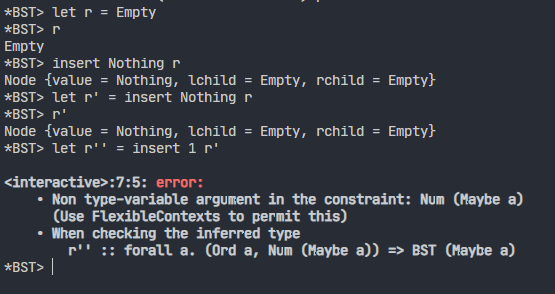

# CPO_life_is_long_no_python_please

## Description

### Objectives

Use development tools: Haskell, IDE/source code editor, git
, Github Actions, and laboratory work process.

Design algorithms and data structures in mutable styles.

Develop unit and property-based tests Students should meet with tools and
typical development workflow on the classical development task in the first
laboratory work: developing a library for a specific data structure.

Students should implement the selected by the variants data structure as a
mutable object (interaction with an object should modify it if applicable). All
 changes should be performed in place, by changing the initial structure.

## Variant

- No.3 Set based on binary-tree

## Struct of project

- The main.hs in app/ is just a file init by cabal. It doesn't matter.

- The implementation of Binary Search Tree is in src/BST.hs.

- The test runs by the cabal, and the test cases are in test/*.hs.

## Key features

- The use of Haskell.

- Achieve a generator of random tree struct.

## Design note

Fix the function `fromList`, now it will build the tree as a normal order.
~~The function ``fromList`` generate a BST by the reverse order by the argus.
(It really confuse me at first because I build the test cases as normal)~~

Build complete pattern matching for every functions.

It's really hard to understand that ``BST Int``,
maybe like the templete in C++?
Like ``BST<int>``.

## Answer for questions

- What should happen, if a user puts `None` value to the data structure?

    Actually there is no `None` in haskell, so that is not a problem.
    But it's funny when it comes to `Nothing`, it's possible and legal
    to insert `Nothing` into an `Empty` tree. Because `Nothing` is an instance
    of `Ord`. And that would lead to error when insert another normal
    data into the tree.

    

- About Test

    We can build the unit test for our code, but when build the cases,
    we are still following the logic we wrote the code. So it is normal that
    we miss some situations.

    PBT test may overcome this problem, it would make test more comprehensive.
    Now, we have used the ``quickcheck`` to generate data and make some tests.
    But there is still a problem that I don't konw how to use ``Arbitrary``.

## Contribution

Zhao, Tianhao is responsible for the implementation of the
data structure and some test cases.

Ge, Binghang edit the Readme and contribute some test cases,
also the action.